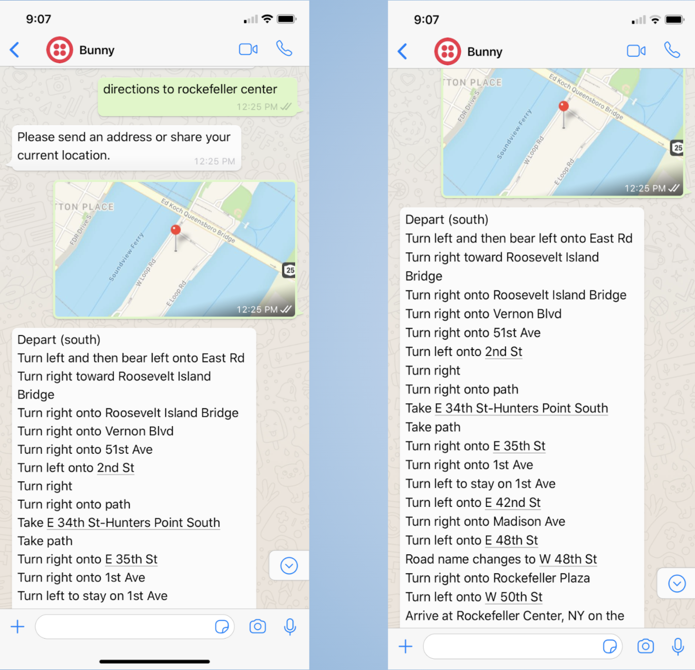

# Better Universal Navigator for NYC (BUNNY 🐇)

This project was from an internship at Cornell Tech in January 2020. 

I was involved in developing New York City’s government information and non-emergency service with <strong>WhatsApp Chatbot</strong> using the <strong>Twilio API </strong>for WhatsApp and the <strong>Flask framework</strong> for Python. Specifically, I built a chatbot that recognizes certain words that I defined in messages sent by the user and reacts to them. If a user types any sentences, and each time the words appear in messages, then the chatbot will invoke the third-party APIs and return some fresh content to them. 

This project has not been open-sourced, unfortunately. However, I am more than happy to create a sample web application project! Please contact me [HERE](https://www.linkedin.com/in/jiseonyu/)😄!

## Demo
🚀🚀 Coming Soon 🚀🚀

### BUNNY's Services 
- Directions using Google Maps

- Schools, Parking, Garbage Services

- Events near me

- Donation location

